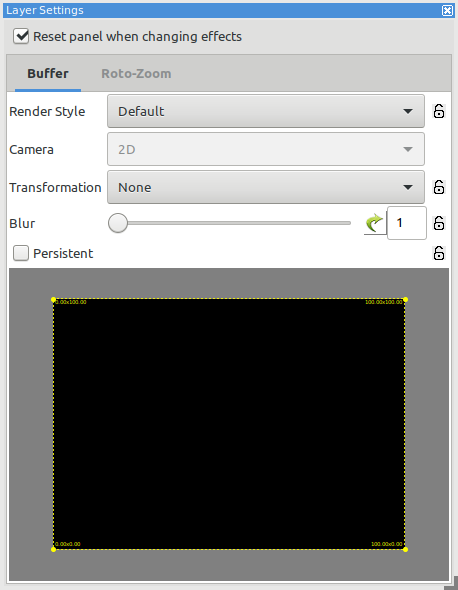
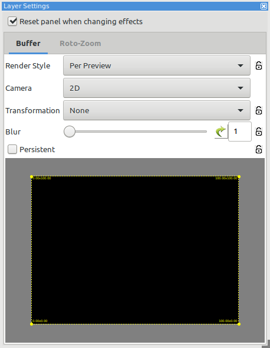

After importing the 2020 xLights around the world sequence "Into the Unknown" we noticed some of the effects we were attempting to map to our spiral pixel trees did not look as expected.

Running Tools > Check Sequence gave a cryptic error message in the "Effect problems" section.

    WARN: Effect Video ends at 3:06.200 after the sequence end 3:06.000. Model: 'All Pixels' Start: 3:03.450
    ERR: Video effect video file '/lightshow/sequences/imports/xLights ATW Into The Unknown/Video/Soft Illumination Blue with Wind.m4v' cannot render onto model as it is not high or wide enough (1,100). Model 'Tree 01', Start 0:25.000

The start time (`Start 0:25.000`) in the error was helpful when attempting to find the broken effect.

The solution turned out to be quite simple. We selected the effect and changed the "Render Style" in the "Layer Settings" panel from "Default" to "Per Preview".

Before

After

The [xLights manual section on Render Style][xlights manual] has a table that describes each of the render styles

[xlights manual]: https://manual.xlights.org/xlights/chapters/chapter-four-sequencer/layers/layer-settings#render-style