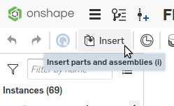
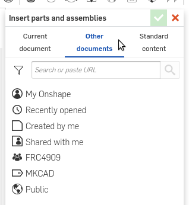
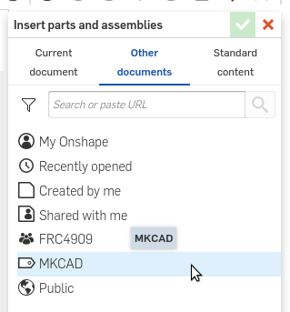
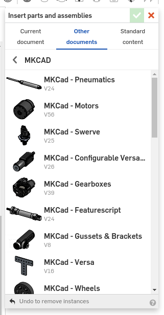
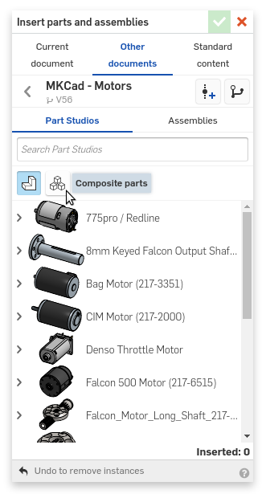

If you are an OnShape user and an FRC team, you've probably heard of MKCad, which is a [user created FRC parts library](https://www.chiefdelphi.com/t/pic-introducing-mkcad-the-onshape-frc-parts-library/161295) by the Team 1836: The Milkenknights.

Here are some tricks to help folks make the most out of MKCad:


One common annoyance is when adding parts from MKCAD avoid all the copies. It can be quite cumbersome to scroll through all the copies and "junk" docs.

Here’s a trick, add the "official" MKCad docs to a label, then in the insert menu you can filter your search by label.

## Easy way to find Official MKCad documents
How to add all the Official MKCad documents to a label
1. [Click here](https://cad.onshape.com/documents?nodeId=3&resourceType=filter&q=type:document%20name:%22MKCad%22%20description:%22Official%22) to get a list of all MKCad documents
2. Click on the first item, then scroll down to the end and shift-click on the last one
3. Right-click then click "Labels…"
4. Either create a new label and call it MKCad or check the MKCad box to add it to your existing MKCad label

### Using the newly created MKCAD label
1. Open an assembly where you would like to use a part from MKCad
2. Click the Insert button

3. Click the "Other Documents" tab in the Insert window

4. Click the "MKCad" label to see only official MKCad documents

5. Proceed to finding the part and inserting.

## Inserting from MKCad without reassembling
Often when working quickly I'll insert a Versa Planetary or wheel from MKCad and get a bunch of disconnected parts.

There are a couple of options, assemble the part yourself, insert an assembly from MKCad (if one exists) or insert a composite part. [Composite parts](https://cad.onshape.com/help/Content/composite_part.htm) are a relatively new feature in OnShape. A composite part is a grouping of parts, surfaces, curves, and/or points that act as one part. The MKCad team has created composite parts for many, if not all, of the multi-part items in the library.

Unfortunately OnShape defaults to not showing composite parts in the insert menu.
Simply click the composite part filter button to show composite parts.

You can even turn off parts and only see composite parts.