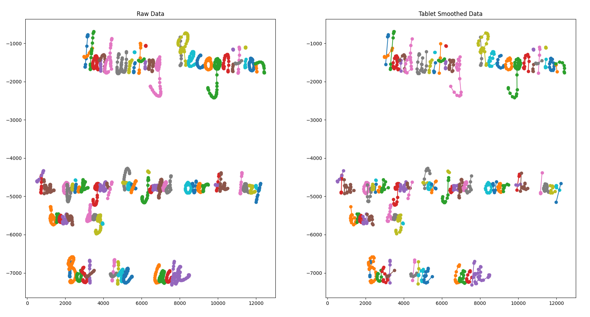
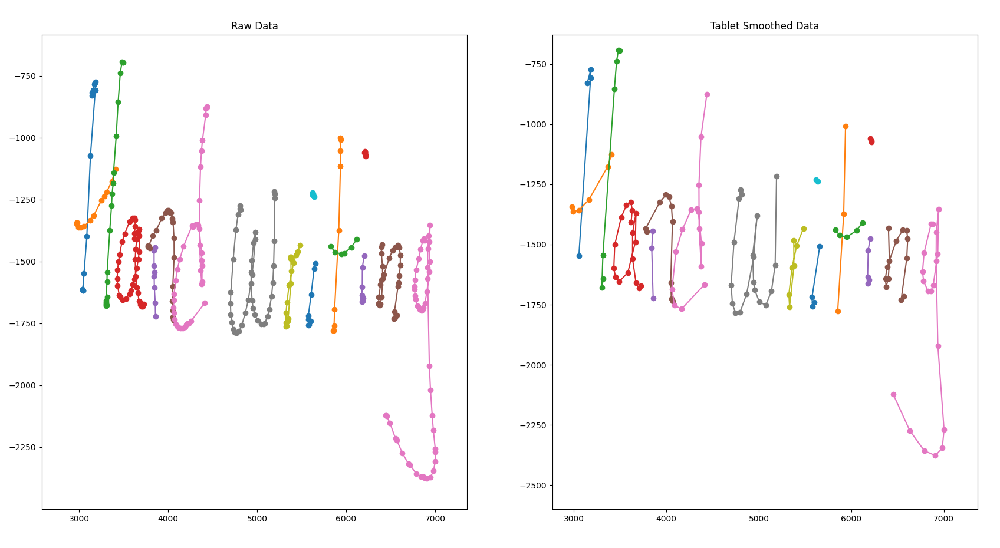
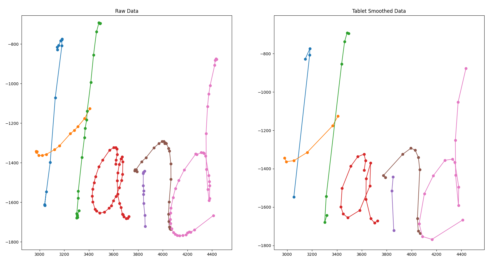
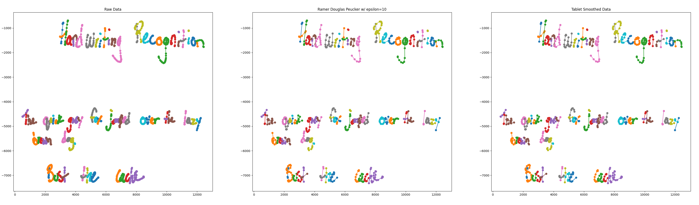
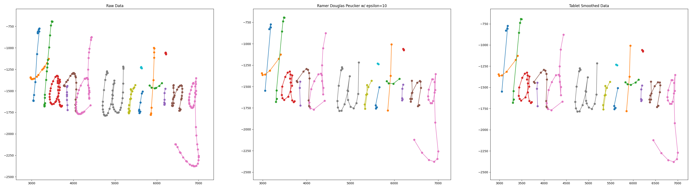
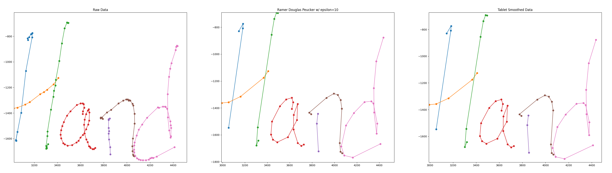

I recently purchased a reMarkable 2 e-ink tablet with the goal of modernizing my note-taking process. My end goal is to make my handwritten notes searchable.

It seems the reMarkable is doing some sort of line simplification before sending the raw x, y coordinates to the [MyScript Handwriting Recognition Service (HWR) service.](https://developer.myscript.com/getting-started)

The following images show initial plotting of the line segments from the binary lines files vs the data sent by the tablet to the HWR service:





These images show the difference between the raw data and what the tablet is sending to the HWR service.

The above images were generated with matplotlib, here is the script:
```python
import matplotlib
import numpy as np
import matplotlib.pyplot as plt
import json, sys, time

def main():
    fig, (ax1, ax2) = plt.subplots(1, 2) # one row of two subplots

    ax1.set_title('Raw Data')
    with open("./raw.json") as f:
        hwrdata = json.load(f)

    for stroke in hwrdata["strokeGroups"][0]['strokes']:
        ax1.plot(stroke['x'], np.array(stroke['y']) * -1, '-o')
    # ---------------------
    ax3.set_title('Tablet Smoothed Data')
    with open("./tablet.json") as f:
        hwrdata = json.load(f)

    for stroke in hwrdata["strokeGroups"][0]['strokes']:
        ax3.plot(stroke['x'], np.array(stroke['y']) * -1, '-o')

    plt.show()

if __name__ == '__main__':
    main()
```

Initial searching took me to [this Stack Overflow post](https://stackoverflow.com/a/26615039)

The example Mike Bostock made showing the use of an algorithm for cartographic simplification, [be sure to check out this demo](https://bost.ocks.org/mike/simplify/).

Mike's demo took me to the [Wikipedia entry for the Ramer Douglas Peucker](https://en.wikipedia.org/wiki/Ramer%E2%80%93Douglas%E2%80%93Peucker_algorithm#Pseudocode) (RDP) algorithm. Just below the psuedocode there is a link to a great [demo by Marius Karthaus](https://karthaus.nl/rdp/) which is worth playing with. By playing with Marius' demo I became convinced that the RDP algorithm warranted some testing.

Expanding on the script from above to add a third subplot using the RDP algorithm to filter the points.





Here is the python script with the addition of RDP:
```python
import matplotlib
import numpy as np
import matplotlib.pyplot as plt
import json
import sys
import time

# Ramer–Douglas–Peucker algorithm
from rdp import rdp


def main():
    fig, (ax1, ax2, ax3) = plt.subplots(1, 3) # one row of three subplots


    ax1.set_title('Raw Data')
    with open("./raw.json") as f:
        hwrdata = json.load(f)

    for stroke in hwrdata["strokeGroups"][0]['strokes']:
        ax1.plot(stroke['x'], np.array(stroke['y']) * -1, '-o')
        # break

    # ---------------------

    epsilon=10
    ax2.set_title('Ramer Douglas Peucker w/ epsilon={}'.format(epsilon))
    with open("./raw.json") as f:
        hwrdata = json.load(f)

    for stroke in hwrdata["strokeGroups"][0]['strokes']:
        x = stroke['x']
        y = np.array(stroke['y']) * -1

        data = np.column_stack((x,y))

        res = rdp(data, epsilon=epsilon)
        res = np.column_stack(res)

        ax2.plot(res[0], res[1], '-o')

    # ---------------------

    ax3.set_title('Tablet Smoothed Data')
    with open("./tablet.json") as f:
        hwrdata = json.load(f)

    for stroke in hwrdata["strokeGroups"][0]['strokes']:
        ax3.plot(stroke['x'], np.array(stroke['y']) * -1, '-o')

    plt.show()

if __name__ == '__main__':
    main()
```

Link to sample of [raw.json](raw.json) and here is [tablet.json](tablet.json)

By visual inspection it appears the RDP with epsilon of 10 achieves the desired goal of closely matching the tablet-generated set of points.