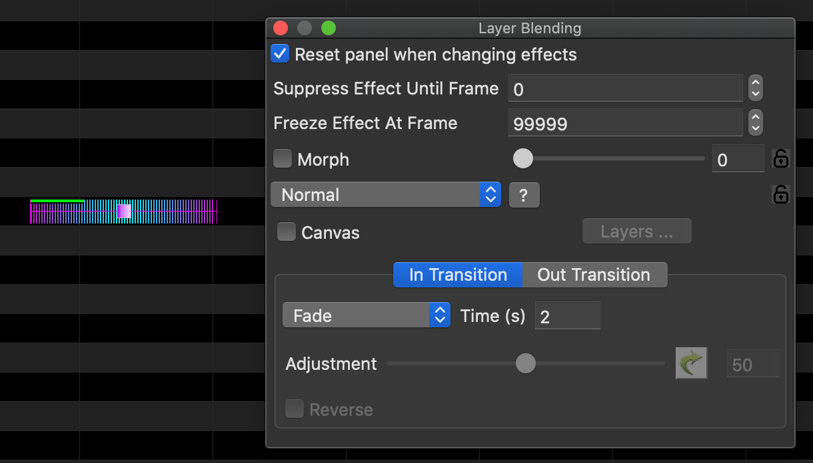

While working on importing the 2020 xLights around the world sequence "Into the Unknown" we noticed the red and green bars on some effects in the sequence. They look like this:

After some prodding we dicovered the red line means transition out, whereas the green line indicates a transition in. 

To create or edit a transition the controls on the Layer Blending menu.

Here is a sample effect with a fade transition in:

Here is a sample effect with a fade transition out:

#til

